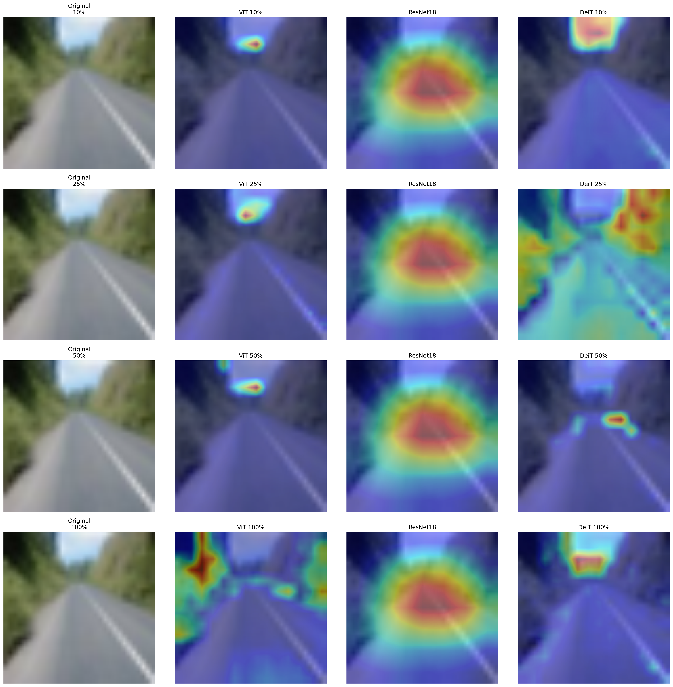

<div align="center">
  <h1>🔍 Distilling Vision: Knowledge Transfer in Transformers</h1>
  <p><i>A Comparative Study of Knowledge Distillation Techniques for Vision Transformers under Limited Training Data</i></p>

  [](https://www.python.org/)
  [](https://pytorch.org/)
  [](https://huggingface.co/spaces/camphor5/cifar100-model-comparison)
  [](https://opensource.org/licenses/MIT)
</div>

---

## Overview
Vision Transformers (ViTs) achieve state-of-the-art performance in computer vision but famously require massive datasets to overcome their lack of inherent spatial inductive biases. This project investigates how **Knowledge Distillation (KD)** can bridge this gap. 

By training a Data-efficient Image Transformer (DeiT-Tiny) using a convolutional ResNet-18 teacher, this study analyzes how effectively Transformers can inherit spatial reasoning in data-constrained environments (10%, 25%, 50%, and 100% of CIFAR-100).

### Live Web Demonstration
Interact with the fully trained models (ResNet-18, ViT, DeiT) directly in your browser. Upload an image to generate live predictions and attention/Grad-CAM maps:
**[Launch Hugging Face Space](https://huggingface.co/spaces/camphor5/cifar100-model-comparison)**

---

## Experimental Results

### Classification Accuracy vs. Data Scale
The distilled DeiT model consistently outperformed the vanilla ViT baseline across all data subsets, proving that distillation acts as a critical mechanism for spatial inductive bias when data is limited.

| Training Data Scale | Vanilla ViT-Tiny | Distilled DeiT-Tiny | Absolute Improvement |
| :--- | :--- | :--- | :--- |
| **10%** (5k images) | 13.46% | 13.69% | +0.23% |
| **25%** (12.5k images) | 19.29% | 22.59% | +3.30% |
| **50%** (25k images) | 27.92% | 34.23% | +6.31% |
| **100%** (50k images)| 39.59% | 45.40% | **+5.81%** |

> **Key Insight:** The DeiT model trained on just 50% of the data (34.23%) achieved performance nearly equivalent to a vanilla ViT trained on 100% of the data (39.59%), effectively halving the required data footprint.

### Training Efficiency
Distillation introduces a slight computational overhead due to the teacher model's forward pass, requiring roughly 6-15% more training time. However, this trade-off yields zero additional parameter cost during inference.

| Data Scale | ViT Training Time (s) | DeiT Training Time (s) |
| :--- | :--- | :--- |
| **10%** | 684.5 | 728.0 |
| **25%** | 1173.2 | 1236.3 |
| **50%** | 1958.0 | 2260.8 |
| **100%** | 3701.9 | 3901.8 |

---

## Visualizing Attention & Interpretability

A core component of this study was tracking how the models "learn to see." Using Grad-CAM for ResNet-18 and Attention Rollout for the Transformers, distinct morphological differences emerged:

1. **The "Collapse" of Vanilla Attention:** At 10% and 25% data regimes, the vanilla ViT fails to localize subjects, with its attention often collapsing to a single background point or scattering randomly.
2. **Distillation as Inductive Bias:** The low-data DeiT immediately locks onto primary subjects (matching the ResNet-18 baseline). It successfully inherits the teacher's broad focus while retaining a granular, patch-based texture.




---

## Repository Structure

```text
├── assets/                  # Directory containing attention map images
├── notebooks/               # Jupyter notebooks for training and evaluation
│   └── training_distillation.ipynb
├── app.py                   # Gradio application for Hugging Face deployment
├── requirements.txt         # Project dependencies
└── README.md                # Project documentation